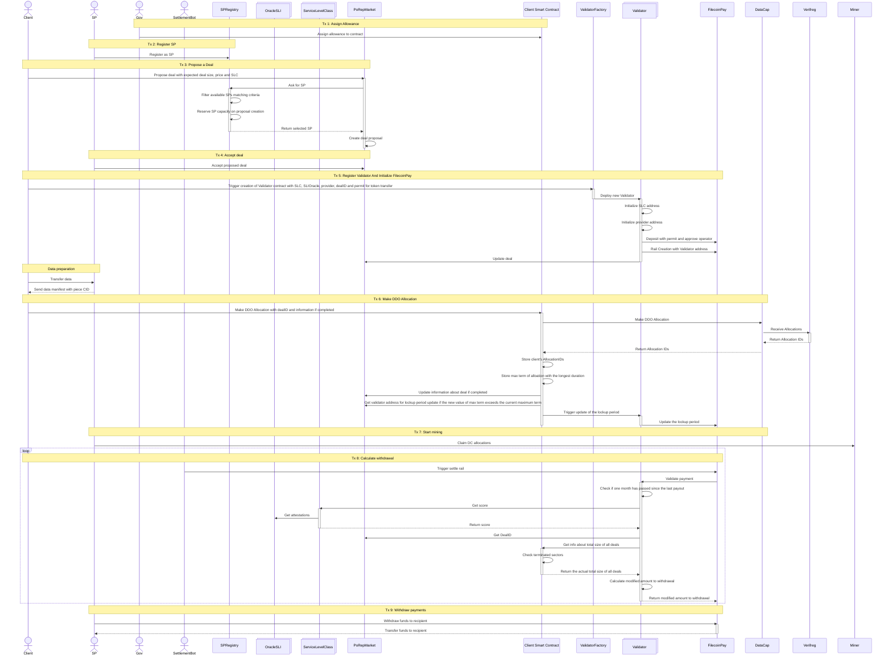

# PoRep Market

## Executive Summary: PoRep Market

### 1. Overview
The **PoRep Market** is a set of smart contracts and off-chain actors designed to automate, manage, and settle storage deals on the Filecoin network. It serves as a middleware that connects **Clients** (data owners) with **Storage Providers** (miners), ensuring that data is not only stored but maintained according to specific quality standards (Service Level Class).

### 2. Key Value Propositions
* **Automated Matchmaking:** Removes the need for manual negotiation by automatically selecting the best-fit Storage Provider (SP) based on capacity and service level class.
* **Performance-Based Payments:** Unlike standard deals, this system uses "Smart Validators" to release payments only when performance metrics (SLIs) are met.
* **Trustless Quality Assurance:** Integrates off-chain Oracles to verify real-world data on-chain.

### 3. System Architecture & Roles

The ecosystem is divided into three functional pillars:

- **PoRep Market & Provider Selection**
  * **PoRep Market:** The core orchestrator. It handles deal proposals, prices, and deal lifecycle updates.
  * **SPRegistry:** A dynamic directory of active Storage Providers. It filters providers to ensure they have the capacity and technical capability to fulfill a client's request.

- **Quality Control (SLA)**
  * **ServiceLevelClass (SLC):** Defines the rules of the deal. It calculates a score for a provider.
  * **OracleSLI:** It feeds off-chain performance data into the blockchain so the SLC contract can evaluate the provider.

- **Financial Settlement & Operations**
  * **Validator:** A specific Validator is deployed for each deal. It validates the provider's performance score before approving any payout.
  * **FilecoinPay:** The underlying payment rail that executes the transfers once validated.
  * **Client Smart Contract:** managing DataCap and tracking allocation metrics.

### 4. Operational Workflow

The lifecycle of a deal follows this high-level logic:

1.  **Proposal:** A Client proposes a deal (size, price, service level). The **PoRep Market** consults the **SPRegistry** to reserve a suitable Provider.
2.  **Setup:** A **Validator** contract is created to secure the funds and link to **FilecoinPay**.
3.  **Execution:** The Client transfers data, and the Provider seals the data (Mining).
4.  **Verification:** A **SettlementBot** periodically triggers a check. The Validator asks the **ServiceLevelClass** for a performance score based on **Oracle** data.
5.  **Settlement:**
    * **High Score:** Funds are released to the Provider.
    * **Low Score:** Payouts are reduced or withheld based on the penalty logic.

### 5. Conclusion
The PoRep Market turns Filecoin storage from a simple yes/no deal into a practical service marketplace. Payments are released only when real performance requirements are met, which protects Clients from bad service and motivates Storage Providers to keep their infrastructure reliable and well-maintained.

## Glossary
We expect following actors and contracts in the system:
1. **Client** - person that has data and wants to store it 
2. **SP** - person that runs a miner that can store data and mine blocks
3. **Gov** - Filecoin governance team
4. **SettlementBot** - off-chain service that triggers settlement-related transaction
5. **SPRegistry** - smart contract that tracks registered Storage Providers participating in the PoRep Market
6. **OracleSLI** -  smart contract that stores off-chain data regarding SLIs for providers
7. **ServiceLevelClass** - smart contract defining service level class for evaluating SLIs
8. **PoRepMarket** - smart contract coordinating deals
9. **Client Smart Contract** - singleton smart contract that helps **Clients** to make allocation and helps track metrics
10. **ValidatorFactory** - smart contract that deploys and registers Validator contracts
11. **Validator** - smart contract that validate payments during settlement
12. [**FilecoinPay**](https://github.com/FilOzone/filecoin-pay) - smart contract enables automated payment channels between payers and recipient
13. **Miner** - instance of the [Miner Actor](https://github.com/filecoin-project/builtin-actors/tree/master/actors/miner)


## PoRep Market

**PoRep Market** is a smart contract responsible for managing deal proposals and updates. It allows clients to propose new deals, automatically selects a Storage Provider (SP) via an external registry, and stores deal proposals on-chain. 

There will be following roles in this contract:
* `ADMIN`, who can upgrade the contract
* `UPGRADER_ROLE`, who can upgrade the contract

Expected interface:
```
interface PoRepMarket {
    function proposeDeal(uint256 expectedDealSize, uint256 priceForDeal, address SLC) external;
    function updateValidatorAndRailId(uint256 dealId, address validator, uint256 railId) external;
    function getDealByRailId(uint256 railId) external view returns (DealProposal memory);
    function acceptDeal(uint256 dealId) external;
    function rejectDeal(uint256 dealId) external;
    function updateDealCompletion(uint256 dealId) external;
}
```

Expected storage items:
```
struct DealProposal {
    uint256 dealId;
    address client;
    CommonTypes.FilActorId provider;
    address SLC; // This will need to be updated after we rethink the SLC Params approach
    address validator;
    DealState state;
    uint256 railId;
    uint256 price;
    uint256 totalDealSize;
}

enum DealState {
    Proposed,
    Accepted,
    Completed,
    Rejected
}

mapping(uint256 => DealProposal) dealProposals;
address SPRegistry;
address ValidatorRegistry;
address ClientContract;
```
// and items inherited from OpenZeppelin's AccessControl, UUPSUpgradeable and Multicall

## Client Smart Contract

**Client Smart Contract** acts as a Verified Registry Client. It has an allowance and may mint DataCap to transfer it to Verifreg create Allocations.

The main function it will implement is `transfer`, which copies the interface of DataCap and expects a transfer of DC to Verifreg with Verifreg-compatible operator data. See [FIDL Client Smart Contract](https://github.com/fidlabs/contract-metaallocator/blob/main/src/Client.sol#L71) for reference. It will mint and  transfer the DataCap and create allocations under following conditions:
1. **Client Smart Contract** has enough allowance

It will also track how much a given **Client** allocated with a given **SP** for a given deal, so that the Validator can check the size of allocations made by the client and compare it with the actual size of **SP** data.

There will be following role in this contract:
* `ADMIN`, who can upgrade the contract

Expected interface:
```
interface Client {
    function transfer(DataCapTypes.TransferParams calldata params, uint256 dealID, bool completed) external;
    function isDataSizeMatching(uint256 dealId) external;
}
```

Expected storage items:
```
struct Deal {
    address client;
    CommonTypes.FilActorId provider;
    uint256 dealID;
    uint256 sizeOfAllocations;
    CommonTypes.ChainEpoch longestDeal
}

address PoRepMarket;
// and items inherited from OpenZeppelin's AccessControl, UUPSUpgradeable and Multicall
```

## OracleSLI

**OracleSLI** is a contract that provides information about off-chain world. Details of logic and interface are between **OracleSLI** and **ServiceLevelClass**.

**FIDLOracle** is a reference **Oracle** provided by FIDL that uses data from DataCapStats for SLIs. It will be upgradeable and implement a following interface:

There will be following role in this contract:
* `UPGRADER`, who can upgrade the contract
* `ORACLE`, which allows to update SLI values

```
interface FIDLOracle {
    struct SLIAttestation {
        uint256 lastUpdate;
        uint16 availability;
        uint16 latency;
        uint16 indexing;
        uint16 retention;
        uint16 bandwidth;
        uint16 stability;
    }
    function setSLI(CommonTypes.FilActorId provider, SLIAttestation calldata slis) external onlyRole(ORACLE_ROLE);
}
```

Expected storage items:
```
mapping(address provider => SLIAttestation attestation) public attestations;
```

## ServiceLevelClass

**ServiceLevelClass** is a smart contract responsible only for storing the assumptions and parameters of a given service level class.

The contract queries the **OracleSLI** contract to retrieve Service Level Indicator (SLI) data for a specific Storage Provider and computes a **score** that represents how well the provider meets the requirements of the selected service level class.

```
interface ServiceLevelClass {
    function score(address provider) external;
}
```

Expected storage items:
```
struct SLCParams {
    uint32 latency; // TTFB in milliseconds
    uint16 retention;
    uint16 bandwidth; // Mbps
    uint16 stability;
    uint8 availability; // 0-100, %
    uint8 indexing; // 0-100, %
}
address OracleSLI;
```

## SPRegistry

**SPRegistry** is a smart contract responsible for storing available Storage Providers (SPs) together with their service parameters. The contract participates in the selection of a Storage Provider based on required deal parameters provided by **PoRep Market**.

The selection logic verifies whether a given SP supports the **ServiceLevelClass (SLC)** chosen by the client and whether its declared capacity is sufficient to handle the deal.

> **Note:** Function definitions may change after the contract is created.

Expected interface:
```
interface SPRegistry {
    function createStorageEntity(address entityOwner, uint64[] calldata storageProviders) external;
    function addStorageProviders(address entityOwner, uint64[] calldata storageProviders) external;
    function removeStorageProviders(address entityOwner, uint64[] calldata storageProviders) external;
    function setStorageEntityActiveStatus(address entityOwner, bool isActive) external;
    function setStorageProviderDetails(address entityOwner, uint64 storageProvider, ProviderDetails calldata details) external;
    function isStorageProviderUsed(uint64 storageProvider) external;
    function getStorageEntity(address entityOwner) external;
    function getStorageEntities() external;
    function selectSp(uint256 dealSize, address SLC) external;
}
```
Expected storage items:
```
struct StorageEntity {
    bool isActive;
    address owner;
    uint64[] storageProviders;
    mapping(uint64 => ProviderDetails) providerDetails;
}

struct ProviderDetails {
    bool isActive;
    uint256 spaceLeft;
}

mapping(address entityOwner => StorageEntity entity) public storageEntities;
mapping(uint64 storageProvider => bool isUsed) public usedStorageProviders;
address[] public entityAddresses;
// and items inherited from OpenZeppelin's AccessControl, UUPSUpgradeable
```

## ValidatorFactory

**ValidatorFactory** is a smart contract responsible for creating new validator instances with a specified admin, **ServiceLevelClass (SLC)** address, and Storage Provider Actor ID.

The contract stores the addresses of all validator contracts it creates and provides a function to verify whether a given address is a validator instance created by the factory.

Expected interface:
```
interface ValidatorFactory {
    function create(address admin, address SLC, CommonTypes.FilActorId provider) external;
}
```

Expected storage items:
```
mapping(address validator => bool isValidator) public isValidator;
```
// and items inherited from OpenZeppelin's AccessControl and the Beacon Proxy Factory upgradeable pattern

## Validator

**Validator** is a smart contract responsible for validating storage deals and managing payments for a specific Storage Provider under a selected **ServiceLevelClass (SLC)**.  
It interacts with **ClientSC** to verify DataCap allocations, computes a score based on the SLC, and manages deposits and payouts.  
The contract separates **Validator** and **Operator** responsibilities by inheriting from abstract contracts and maintains a lockup period for funds.

Expected interface:
```
interface Validator {
    function depositWithPermitAndApproveOperator(address payerAddress, uint256 amount, address SLC, uint256 expectedDeadline) internal;

    function createRail(address payerAddress, address payee) internal;

    function terminateRail(uint256 dealID) external;

    function validatePayment(uint256 railId, uint256 proposedAmount, uint256 fromEpoch, uint256 toEpoch, uint256 rate) external;
    function updateLockupPeriod(uint256 dealID);
    function railTerminated(uint256 railId, address terminator, uint256 endEpoch) external;
}
```
Expected storage items:
```
struct ValidationResult {
    uint256 modifiedAmount;
    uint256 settleUpto;
    string note;
}
address ClientSmartContract
address PoRepMarket
```

## Diagrams

A typical full flow from proposing a deal to withdrawing rewards will look as follows:


