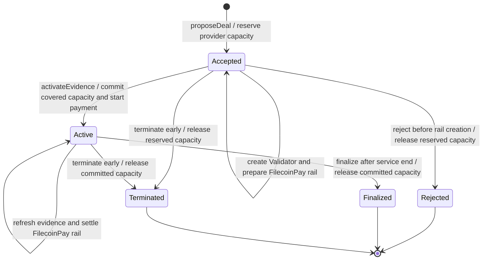

# PoRep Market

PoRep Market V2 coordinates Filecoin storage deals between clients and Storage
Providers (SPs). It matches deal requests to provider offers, validates storage
evidence, tracks provider capacity and deal state, and controls settlement
through per-deal FilecoinPay validators.

The contracts, interfaces, and tests are authoritative. This README maintains
only the system ownership and deal lifecycle needed to navigate them.

## Deployments

### V2

- [Latest Calibnet deployment](https://github.com/fidlabs/porep-market/blob/main/deployments/calibnet/latest.json)
- [Mainnet deployment](https://github.com/fidlabs/porep-market/blob/main/deployments/mainnet/latest.json) — V2 alpha technical release.

### V1

- [Latest Calibnet deployment](https://github.com/fidlabs/porep-market/blob/v1/deployments/calibnet/latest.json)
- [Latest mainnet deployment](https://github.com/fidlabs/porep-market/blob/v1/deployments/mainnet/latest.json)

`main` contains V2. V1 maintenance, releases, deployments, and upgrades belong
on the separate `v1` branch.

## Architecture

- [`PoRepMarket`](src/PoRepMarket.sol) owns deal state, frozen deal terms,
  service dates, payment calculation, settlement progress, and lifecycle
  transitions. Its external contract is
  [`IPoRepMarket`](src/interfaces/IPoRepMarket.sol).
- [`SPRegistry`](src/SPRegistry.sol) stores providers and their mutable offers,
  selects an offer for a request, and tracks available, reserved, and committed
  capacity.
- [`DataCapEvidenceAdapter`](src/DataCapEvidenceAdapter.sol) submits DataCap
  allocations, records Filecoin claims, and reports covered bytes. Evidence
  adapters implement
  [`IStorageEvidenceAdapter`](src/interfaces/IStorageEvidenceAdapter.sol).
- [`Validator`](src/Validator.sol) is the per-deal FilecoinPay operator. It
  controls the payment rail and delegates settlement decisions to
  `PoRepMarket`.
- [`ValidatorFactory`](src/ValidatorFactory.sol) creates Validator beacon
  proxies for deals.
- [`SLIOracle`](src/SLIOracle.sol) stores provider attestations, and
  [`SLIScorer`](src/SLIScorer.sol) evaluates the deal's frozen SLI thresholds
  during settlement.
- [FilecoinPay](https://github.com/FilOzone/filecoin-pay) holds client funds,
  settles rails through Validator, and pays providers.

Canonical lifecycle codes and data structures live in
[`DealState`](src/types/DealState.sol),
[`PoRepTypes`](src/types/PoRepTypes.sol), and
[`SharedTypes`](src/types/SharedTypes.sol).

### Why the adapter exists

DataCap and VerifReg are the current way PoRep Market checks storage, but this
path is being phased out. V2 cannot bake DataCap allocations and claims into
its deal and payment model and then require another market redesign when
Filecoin removes them.

The adapter is the transition boundary. It translates whichever Filecoin
storage mechanism is available into the few facts PoRep Market needs: how many
deal bytes have storage coverage, whether the deal can activate, and whether
that coverage is still current.

Today `DataCapEvidenceAdapter` gets those facts from DataCap allocations and
VerifReg claims. A later adapter can use the post-DataCap mechanism without
changing `PoRepMarket`, `Validator`, or the existing deal ABI.

Each deal keeps the adapter selected when it was created. New deals can move to
the replacement while older deals remain tied to the path they started with.

The code calls these storage facts **evidence**. Evidence here means the
on-chain information used to check storage coverage; it does not mean that
every adapter returns a cryptographic proof. The rest of this README calls it
the adapter.

## Deal lifecycle

```mermaid
stateDiagram-v2
    [*] --> Accepted: proposeDeal / reserve provider capacity

    Accepted --> Accepted: create Validator and prepare FilecoinPay rail
    Accepted --> Active: activateEvidence / commit covered capacity and start payment
    Accepted --> Rejected: reject before rail creation / release reserved capacity
    Accepted --> Terminated: terminate early / release reserved capacity

    Active --> Active: refresh evidence and settle FilecoinPay rail
    Active --> Finalized: finalize after service end / release committed capacity
    Active --> Terminated: terminate early / release committed capacity

    Rejected --> [*]
    Finalized --> [*]
    Terminated --> [*]
```

[`proposeDeal`](src/PoRepMarket.sol) selects and reserves a provider offer.
[`proposeDealWithSpecificOffer`](src/PoRepMarket.sol) lets an administrator
reserve a specific offer. Both create an `ACCEPTED` deal with a snapshot of the
selected provider, payment terms, promised SLIs, and reserved bytes.

While a deal is `ACCEPTED`, its client creates a Validator through
[`ValidatorFactory`](src/ValidatorFactory.sol), approves it as a FilecoinPay
operator, and calls [`Validator.createRail`](src/Validator.sol). The client
posts DataCap through the deal's evidence adapter. The PoRep service then
submits claim evidence and calls [`activateEvidence`](src/PoRepMarket.sol).
Successful activation commits the covered capacity, moves the deal to `ACTIVE`,
sets its service window, and starts payment.

While the deal is `ACTIVE`, the PoRep service calls
[`refreshEvidenceStatus`](src/PoRepMarket.sol) to keep evidence current.
FilecoinPay calls [`Validator.validatePayment`](src/Validator.sol), which asks
[`PoRepMarket.validateDealSettlement`](src/PoRepMarket.sol) for the accepted
amount and settlement epoch.

After the service end epoch, [`finalizeDeal`](src/PoRepMarket.sol) terminates
the rail and releases committed capacity. [`terminateDeal`](src/PoRepMarket.sol)
handles early termination from a prepared or active rail.
[`rejectAcceptedDeal`](src/PoRepMarket.sol) releases reserved capacity for an
accepted deal that does not yet have a rail.

## Important invariants

- Provider offers may change, but the provider, payment terms, promised SLIs,
  and reserved bytes copied into a deal do not follow later offer changes.
- Deal state, evidence status, and FilecoinPay rail status advance through
  separate contract calls.
- The evidence adapter owns evidence-specific facts. `PoRepMarket` owns deal
  state, settlement decisions, and settlement accounting.
- Provider capacity is reserved when the deal is created, committed using
  covered bytes on activation, and released on rejection, termination, or
  finalization.
- Validator implements FilecoinPay's validation interface, while
  `PoRepMarket.validateDealSettlement` computes the accepted amount and updates
  settlement progress.

## Development and deployment commands

The [`justfile`](justfile) is the command reference. Run `just --list` to see
the commands supported by the current checkout. Deployment behavior is
implemented in [`script/deployment.ts`](script/deployment.ts).

Run `just pre-push` before pushing changes.
