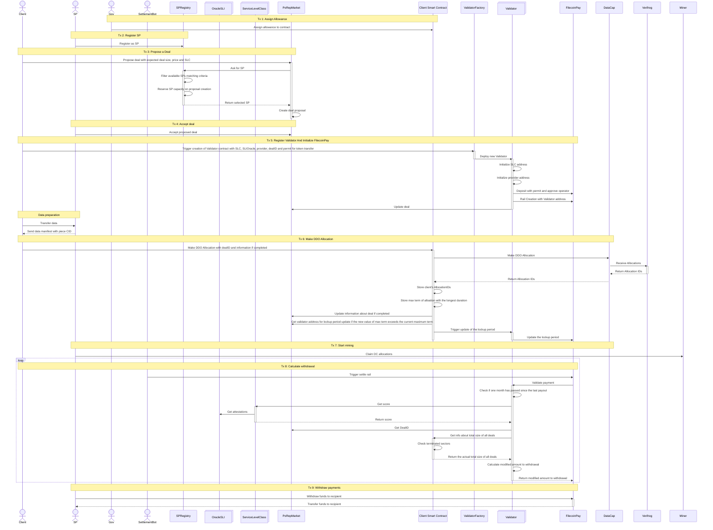

# PoRep Market

## Executive Summary: PoRep Market

### 1. Overview
The **PoRep Market** is a set of smart contracts and off-chain actors designed to automate, manage, and settle storage deals on the Filecoin network. It serves as a middleware that connects **Clients** (data owners) with **Storage Providers** (miners), ensuring that data is not only stored but maintained according to explicitly defined minimum values for selected performance indicators.

### 2. Key Value Propositions
* **Automated Matchmaking:** Removes the need for manual negotiation by automatically selecting the best-fit Storage Provider (SP) based on capacity and and predefined minimum values for selected performance indicators.
* **Performance-Based Payments:** Unlike standard deals, this system uses "Smart Validators" to release payments only when performance metrics (SLIs) are met.
* **Trustless Quality Assurance:** Integrates off-chain Oracles to verify real-world data on-chain.

### 3. System Architecture & Roles

The ecosystem is divided into three functional pillars:

- **PoRep Market & Provider Selection**
  * **PoRep Market:** The core orchestrator. It handles deal proposals, prices, and deal lifecycle updates.
  * **SPRegistry:** A dynamic directory of active Storage Providers. It filters providers to ensure they have the capacity and technical capability to fulfill a client's request.

- **Quality Control (SLA)**
  * **SLIScorer:** Defines the rules of the deal by evaluating Storage Providers based on selected indicators and calculating their overall score.
  * **OracleSLI:** It feeds off-chain performance data into the blockchain so the SLIScorer can evaluate the provider.

- **Financial Settlement & Operations**
  * **Validator:** A specific Validator is deployed for each deal. It validates the provider's performance score before approving any payout.
  * **FilecoinPay:** The underlying payment rail that executes the transfers once validated.
  * **Client Smart Contract:** managing DataCap and tracking allocation metrics.

### 4. Operational Workflow

The lifecycle of a deal follows this high-level logic:

1.  **Proposal:** A Client proposes a deal (size, price, service level). The **PoRep Market** consults the **SPRegistry** to reserve a suitable Provider.
2.  **Setup:** A **Validator** contract is created to secure the funds and link to **FilecoinPay**.
3.  **Execution:** The Client transfers data, and the Provider seals the data (Mining).
4.  **Verification:** A **SettlementBot** periodically triggers a check. The Validator asks the **SLIScorer** for a performance score based on **Oracle** data.
5.  **Settlement:**
    * **High Score:** Funds are released to the Provider.
    * **Low Score:** Payouts are reduced or withheld based on the penalty logic.
6.  **Deal Termination:** Once the agreed deal duration expires, the deal is automatically terminated. Any remaining locked funds are settled according to the contract logic, and the Validator is finalized.

### 5. Conclusion
The PoRep Market turns Filecoin storage from a simple yes/no deal into a practical service marketplace. Payments are released only when real performance requirements are met, which protects Clients from bad service and motivates Storage Providers to keep their infrastructure reliable and well-maintained.

## Glossary
We expect following actors and contracts in the system:
1. **Client** - person that has data and wants to store it
2. **SP** - person that runs a miner that can store data and mine blocks
3. **Gov** - Filecoin governance team
4. **SettlementBot** - off-chain service that triggers settlement-related transaction
5. [**SPRegistry**](#spregistry) - smart contract that tracks registered Storage Providers participating in the PoRep Market
6. [**OracleSLI**](#oraclesli) - smart contract that stores off-chain data regarding SLIs for providers
7. [**SLIScorer**](#sliscorer) - smart contract that evaluates Storage Providers by calculating a score based on predefined minimum values for selected Service Level Indicators (SLIs).
8. [**PoRepMarket**](#porep-market) - smart contract coordinating deals
9. [**Client Smart Contract**](#client-smart-contract) - singleton smart contract that helps **Clients** to make allocation and helps track metrics
10. [**ValidatorFactory**](#validatorfactory) - smart contract that deploys and registers Validator contracts
11. [**Validator**](#validator) - smart contract that validate payments during settlement
12. [**MetaAllocator**](https://github.com/fidlabs/contract-metaallocator) - external FIDL contract acting as a Notary/Verifier on Filecoin that grants DataCap allowances to clients
13. [**FilecoinPay**](https://github.com/FilOzone/filecoin-pay) - smart contract enables automated payment channels between payers and recipient
14. **Miner** - instance of the [Miner Actor](https://github.com/filecoin-project/builtin-actors/tree/master/actors/miner)

## PoRep Market

**PoRep Market** is a smart contract responsible for managing deal proposals and updates. It allows clients to propose new deals, automatically selects a Storage Provider (SP) via an external registry, and stores deal proposals on-chain. 

There will be following roles in this contract:
* `DEFAULT_ADMIN_ROLE`, who can manage the contract and set the Client Smart Contract address
* `UPGRADER_ROLE`, who can upgrade the contract

Implementation
* interface: [IPoRepMarket](src/interfaces/IPoRepMarket.sol)
* smart contract: [PoRepMarket](src/PoRepMarket.sol)

## Client Smart Contract

**Client Smart Contract** acts as a Verified Registry Client. It has an allowance and may mint DataCap to transfer it to Verifreg create Allocations.

The main function it will implement is `transfer`, which copies the interface of DataCap and expects a transfer of DC to Verifreg with Verifreg-compatible operator data. See [FIDL Client Smart Contract](https://github.com/fidlabs/contract-metaallocator/blob/main/src/Client.sol#L71) for reference. It will mint and  transfer the DataCap and create allocations under following conditions:
1. **Client Smart Contract** has enough allowance

It will also track how much a given **Client** allocated with a given **SP** for a given deal, so that the Validator can check the size of allocations made by the client and compare it with the actual size of **SP** data.

There will be following roles in this contract:
* `DEFAULT_ADMIN_ROLE`, who can manage the contract
* `UPGRADER_ROLE`, who can upgrade the contract
* `ALLOCATOR_ROLE`, who can increase and decrease allowances
* `TERMINATION_ORACLE`, external service that updates the contract about early terminated sectors

Implementation
* smart contract: [Client](src/Client.sol)

## OracleSLI

**OracleSLI** is a contract that provides information about off-chain world.

**FIDLOracle** is a reference **Oracle** provided by FIDL that uses data from DataCapStats for SLIs. It will be upgradeable and implement a following interface:

There will be following roles in this contract:
* `UPGRADER_ROLE`, who can upgrade the contract
* `ORACLE_ROLE`, which allows to update SLI values

Implementation
* interface: [ISLIOracle](src/interfaces/ISLIOracle.sol)
* smart contract: [SLIOracle](src/SLIOracle.sol)

## SLIScorer

**SLIScorer** is a smart contract responsible for calculating a score for a given provider based on the required Service Level Indicators (SLIs) and the actual SLIs reported by the **OracleSLI** contract.

There will be following roles in this contract:
* `DEFAULT_ADMIN_ROLE`, who can manage the contract
* `UPGRADER_ROLE`, who can upgrade the contract

Implementation
* interface: [ISLIScorer](src/interfaces/ISLIScorer.sol)
* smart contract: [SLIScorer](src/SLIScorer.sol)

## SPRegistry

**SPRegistry** is a smart contract responsible for storing available Storage Providers (SPs) together with their service parameters. The contract participates in the selection of a Storage Provider based on required deal parameters provided by **PoRep Market**.

The selection logic verifies whether a given SP meets the **SLI thresholds** required by the client and whether its declared capacity is sufficient to handle the deal.

Implementation
* interface: [ISPRegistry](src/interfaces/ISPRegistry.sol)
* smart contract: [SPRegistry](src/SPRegistry.sol)

## ValidatorFactory

**ValidatorFactory** is a smart contract responsible for creating new validator instances for a given deal.

The contract stores the addresses of all validator contracts it creates and provides a function to verify whether a given address is a validator instance created by the factory.

There will be following roles in this contract:
* `DEFAULT_ADMIN_ROLE`, who can manage the contract
* `UPGRADER_ROLE`, who can upgrade the contract

Implementation
* smart contract: [ValidatorFactory](src/ValidatorFactory.sol)

## Validator

**Validator** is a smart contract responsible for validating storage deals and managing payments for a specific Storage Provider under defined **Service Level Indicators** (SLIs) requirements.
It interacts with **ClientSC** to verify DataCap allocations, computes a score based on the required **SLIs**, and manages deposits and payouts.
The contract separates **Validator** and **Operator** responsibilities by inheriting from abstract contracts and maintains a lockup period for funds.

There will be following roles in this contract:
* `DEFAULT_ADMIN_ROLE`, who can manage the contract and update the lockup period
* `POREP_SERVICE_ROLE`, the off-chain bot that triggers settlement, modifies rail payment rate, and disables future payments

Implementation
* interface: [IValidator](src/interfaces/IValidator.sol)
* smart contract: [Validator](src/Validator.sol)

## Diagrams

A typical full flow from proposing a deal to withdrawing rewards will look as follows:

## Diagrams

A typical full flow from proposing a deal to withdrawing rewards will look as follows:

```mermaid
sequenceDiagram
  actor Client
  actor SP
  actor Gov
  actor SettlementBot
  participant SPRegistry
  participant OracleSLI@{ "type" : "collections" }
  participant ServiceLevelClass@{ "type" : "collections" }
  participant PoRepMarket
  participant ClientSC as Client Smart Contract
  participant ValidatorFactory
  participant Validator@{ "type" : "collections" }
  participant FilecoinPay
  participant DataCap
  participant Verifreg
  participant Miner
  
  note over Gov, ClientSC: Tx 1: Assign Allowance
    Gov->>ClientSC: Assign allowance to contract

  note over SP,SPRegistry: Tx 2: Register SP
    SP->>SPRegistry: Register as SP

  note over Client, PoRepMarket: Tx 3: Propose a Deal
    Client->>PoRepMarket: Propose deal with expected deal size, price and SLC 
    activate PoRepMarket
    PoRepMarket->>SPRegistry: Ask for SP
    activate SPRegistry
    SPRegistry->>SPRegistry: Filter available SPs matching criteria
    SPRegistry->>SPRegistry: Reserve SP capacity on proposal creation
    SPRegistry-->> PoRepMarket: Return selected SP
    deactivate SPRegistry
    PoRepMarket->>PoRepMarket: Create deal proposal
    deactivate PoRepMarket

  note over SP, PoRepMarket: Tx 4: Accept deal
    SP->>PoRepMarket: Accept proposed deal

  note over Client, FilecoinPay: Tx 5: Register Validator And Initialize FilecoinPay
    Client->>ValidatorFactory: Trigger creation of Validator contract with SLC, SLIOracle, provider, dealID and permit for token transfer
    activate ValidatorFactory
    ValidatorFactory->>Validator: Deploy new Validator
    deactivate ValidatorFactory
    activate Validator
    Validator->>Validator: Initialize SLC address
    Validator->>Validator: Initialize provider address
    Validator->>FilecoinPay: Deposit with permit and approve operator
    Validator->>FilecoinPay: Rail Creation with Validator address
    Validator->>PoRepMarket: Update deal
    deactivate Validator

  note over Client, SP: Data preparation
    Client->>SP: Transfer data
    SP-->>Client: Send data manifest with piece CID
  
  note over Client,DataCap: Tx 6: Make DDO Allocation
    Client->>ClientSC: Make DDO Allocation with dealID and information if completed
    activate ClientSC
    ClientSC->>DataCap: Make DDO Allocation
    activate DataCap
    DataCap->>Verifreg: Receive Allocations
    activate Verifreg
    Verifreg-->>DataCap: Return Allocation IDs
    deactivate Verifreg
    DataCap-->>ClientSC: Return Allocation IDs
    ClientSC->>ClientSC: Store client's AllocationIDs
    ClientSC->>ClientSC: Store max term of alloation with the longest duration
    ClientSC->>PoRepMarket: Update information about deal if completed 
    ClientSC->>PoRepMarket: Get validator address for lockup period update if the new value of max term exceeds the current maximum term
    ClientSC->> Validator: Trigger update of the lockup period
    activate Validator
    Validator->>FilecoinPay: Update the lockup period
    deactivate ClientSC
    deactivate Validator 
  
  note over SP,DataCap: Tx 7: Start mining
  SP->>Miner: Claim DC allocations 

  loop
  note over Client, FilecoinPay: Tx 8: Calculate withdrawal
    SettlementBot->>FilecoinPay: Trigger settle rail  
    FilecoinPay->>Validator: Validate payment
    activate Validator
    Validator->>Validator: Check if one month has passed since the last payout
    Validator->>ServiceLevelClass: Get score
    activate ServiceLevelClass
    ServiceLevelClass->>OracleSLI: Get attestations
    ServiceLevelClass-->>Validator: Return score
    deactivate ServiceLevelClass
    Validator ->>PoRepMarket: Get DealID
    Validator->>ClientSC: Get info about total size of all deals
    activate ClientSC
    ClientSC->>ClientSC: Check terminated sectors
    ClientSC-->>Validator: Return the actual total size of all deals
    deactivate ClientSC 
    Validator->>Validator: Calculate modified amount to withdrawal
    Validator-->>FilecoinPay: Return modified amount to withdrawal
    deactivate Validator
  end

  note over SP, FilecoinPay: Tx 9: Withdraw payments
  SP->>FilecoinPay: Withdraw funds to recipient
  activate FilecoinPay
  FilecoinPay-->>SP: Transfer funds to recipient
  deactivate FilecoinPay
```
