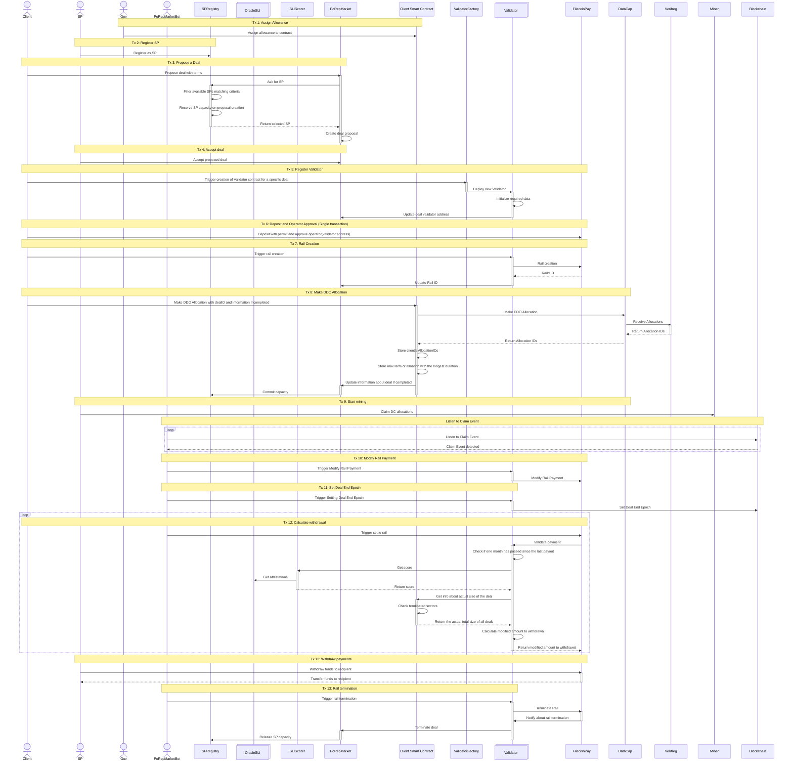

# PoRep Market

## Overview

The **PoRep Market** is a set of smart contracts and off-chain actors designed to automate, manage, and settle storage deals on the Filecoin network. It connects **Clients** (data owners) with **Storage Providers** (miners), ensuring that data is not only stored but maintained according to specific quality standards defined by SLI (Service Level Indicator) thresholds.

### Key Value Propositions

* **Automated Matchmaking:** Automatically selects the best-fit Storage Provider based on capacity, SLI capabilities, and pricing.
* **Performance-Based Payments:** Validators release payments only when all performance metrics (SLIs) are met; payments are withheld for periods where requirements are not satisfied.
* **Trustless Quality Assurance:** Off-chain oracles feed real-world performance data on-chain for transparent, verifiable scoring.

## Architecture

The system is organized into three pillars:

**Deal Orchestration & Provider Selection**
* **[PoRepMarket](src/interfaces/IPoRepMarket.sol)** -- Core deal state machine. Manages the full deal lifecycle: proposal, acceptance, completion, rejection, and termination.
* **[SPRegistry](src/interfaces/ISPRegistry.sol)** -- Provider directory. Stores provider capabilities, capacity, pricing, and handles provider matching for incoming deals.

**Quality Control (SLI)**
* **[SLIScorer](src/interfaces/ISLIScorer.sol)** -- Computes a performance score for a provider by comparing deal requirements against oracle attestations.
* **[SLIOracle](src/interfaces/ISLIOracle.sol)** -- Stores off-chain [SLI attestation data](src/types/SLITypes.sol) pushed by an oracle service.

**Financial Settlement**
* **[Validator](src/interfaces/IValidator.sol)** -- One instance per deal (deployed via beacon proxy). Validates provider performance before approving payouts, manages lockup periods, and handles deal termination.
* **[ValidatorFactory](src/ValidatorFactory.sol)** -- Creates Validator instances via the beacon proxy pattern.
* **[Client](src/Client.sol)** -- Manages DataCap allocations via FEVM precompiles, tracks allocation sizes per deal, and monitors sector terminations. Receives its DataCap allowance from the MetaAllocator.
* **[FilecoinPay](https://github.com/FilOzone/filecoin-pay)** -- External payment rail that executes streaming transfers once validated.

## Deal Lifecycle

```
proposeDeal() --> [Proposed] --> acceptDeal() --> [Accepted] --> completeDeal() --> [Completed]
                      |                                                               |
                      +-- rejectDeal() --> [Rejected]               terminateDeal() --+--> [Terminated]
```

1. **Proposal** -- A Client proposes a deal ([terms and SLI requirements](src/types/SLITypes.sol)). The PoRepMarket consults SPRegistry to reserve a suitable Provider.
2. **Acceptance** -- The matched SP accepts the deal.
3. **Validator Setup** -- The Client creates a Validator contract for the deal, approves it as an operator on FilecoinPay, and the Validator creates a payment rail between the Client (payer) and SP (payee).
4. **Data Transfer & Allocation** -- The Client transfers data to the SP, then makes DDO allocations via the Client contract. The Client contract requests DataCap from the MetaAllocator and tracks allocation sizes per deal.
5. **Mining** -- The SP claims DataCap allocations and begins sealing sectors.
6. **Settlement** -- A SettlementBot periodically triggers settlement. The Validator queries the SLIScorer for a performance score, verifies allocation sizes against the Client contract, and returns a modified payout amount to FilecoinPay.
7. **Withdrawal** -- The SP withdraws earned funds from FilecoinPay.
8. **Termination** -- When the deal duration expires or a deal is terminated early, the payment rail is closed, final settlement is processed, and the provider's reserved capacity is released.

## Glossary

| Term | Description |
|------|-------------|
| **Client** | Data owner who wants to store data on Filecoin |
| **SP** | Storage Provider running a miner that stores data and mines blocks |
| **Gov** | Filecoin governance team that assigns allowances |
| **SettlementBot** | Off-chain service that triggers settlement transactions |
| **PoRepMarket** | Smart contract orchestrating the deal lifecycle |
| **SPRegistry** | Smart contract tracking registered Storage Providers, their capabilities, and pricing |
| **SLIOracle** | Smart contract storing off-chain SLI attestations for providers |
| **SLIScorer** | Smart contract that scores provider performance against deal requirements |
| **Client (contract)** | Singleton smart contract managing DataCap allocations and tracking deal metrics |
| **[MetaAllocator](https://github.com/fidlabs/contract-metaallocator)** | External Verifier/Notary contract that grants DataCap allowance to the Client contract |
| **ValidatorFactory** | Smart contract deploying per-deal Validator instances via beacon proxy |
| **Validator** | Per-deal smart contract validating payments during settlement |
| **[FilecoinPay](https://github.com/FilOzone/filecoin-pay)** | Smart contract enabling streaming payment channels between payers and recipients |
| **Miner** | Instance of the [Miner Actor](https://github.com/filecoin-project/builtin-actors/tree/master/actors/miner) |

## System Flow


```mermaid
sequenceDiagram
  actor Client
  actor SP
  actor Gov
  actor PoRepMarketBot
  participant SPRegistry
  participant OracleSLI@{ "type" : "collections" }
  participant SLIScorer
  participant PoRepMarket
  participant ClientSC as Client Smart Contract
  participant ValidatorFactory
  participant Validator@{ "type" : "collections" }
  participant FilecoinPay
  participant DataCap
  participant Verifreg
  participant Miner
  participant Blockchain
  

note over Gov,ClientSC: Tx 1: Assign Allowance
    Gov->>ClientSC: Assign allowance to contract

note over SP,SPRegistry: Tx 2: Register SP
    SP->>SPRegistry: Register as SP

note over Client, PoRepMarket: Tx 3: Propose a Deal
    Client->>PoRepMarket: Propose deal with terms 
    activate PoRepMarket
    PoRepMarket->>SPRegistry: Ask for SP
    activate SPRegistry
    SPRegistry->>SPRegistry: Filter available SPs matching criteria
    SPRegistry->>SPRegistry: Reserve SP capacity on proposal creation
    SPRegistry-->> PoRepMarket: Return selected SP
    deactivate SPRegistry
    PoRepMarket->>PoRepMarket: Create deal proposal
    deactivate PoRepMarket

note over SP, PoRepMarket: Tx 4: Accept deal
    SP->>PoRepMarket: Accept proposed deal

note over Client, FilecoinPay: Tx 5: Register Validator
    Client->>ValidatorFactory: Trigger creation of Validator contract for a specific deal
    activate ValidatorFactory
    ValidatorFactory->>Validator: Deploy new Validator
    deactivate ValidatorFactory
    activate Validator
    Validator->>Validator: Initialize required data
    Validator->>PoRepMarket: Update deal validator address 
    deactivate Validator

note over Client, FilecoinPay: Tx 6: Deposit and Operator Approval (Single transaction)
    Client->> FilecoinPay: Deposit with permit and approve operator(validator address)

note over Client, FilecoinPay: Tx 7: Rail Creation
    Client->> Validator: Trigger rail creation
    activate Validator
    Validator->> FilecoinPay: Rail creation
    FilecoinPay-->>Validator: Raild ID
    Validator ->> PoRepMarket: Update Rail ID 
    deactivate Validator 

note over Client,DataCap: Tx 8: Make DDO Allocation
    Client->>ClientSC: Make DDO Allocation with dealID and information if completed
    activate ClientSC
    ClientSC->>DataCap: Make DDO Allocation
    activate DataCap
    DataCap->>Verifreg: Receive Allocations
    activate Verifreg
    Verifreg-->>DataCap: Return Allocation IDs
    deactivate Verifreg
    DataCap-->>ClientSC: Return Allocation IDs
    ClientSC->>ClientSC: Store client's AllocationIDs
    ClientSC->>ClientSC: Store max term of alloation with the longest duration
    ClientSC->>PoRepMarket: Update information about deal if completed 
    activate PoRepMarket
    PoRepMarket->> SPRegistry: Commit capacity
    deactivate PoRepMarket
    deactivate ClientSC

  
note over SP,DataCap: Tx 9: Start mining
  SP->>Miner: Claim DC allocations 

note over PoRepMarketBot, Blockchain: Listen to Claim Event
loop
    PoRepMarketBot->>Blockchain: Listen to Claim Event
    Blockchain-->>PoRepMarketBot: Claim Event detected
end

note over PoRepMarketBot, FilecoinPay: Tx 10: Modify Rail Payment
PoRepMarketBot->>Validator: Trigger Modify Rail Payment
activate Validator
Validator->>FilecoinPay: Modify Rail Payment
deactivate Validator

note over PoRepMarketBot, Validator: Tx 11: Set Deal End Epoch
PoRepMarketBot->>Validator: Trigger Setting Deal End Epoch
activate Validator
Validator->>Blockchain: Set Deal End Epoch
deactivate Validator

loop
note over Client, FilecoinPay: Tx 12: Calculate withdrawal
    PoRepMarketBot->>FilecoinPay: Trigger settle rail  
    FilecoinPay->>Validator: Validate payment
    activate Validator
    Validator->>Validator: Check if one month has passed since the last payout
    Validator->>SLIScorer: Get score
    activate SLIScorer
    SLIScorer->>OracleSLI: Get attestations
    SLIScorer-->>Validator: Return score
    deactivate SLIScorer
    Validator->>ClientSC: Get info about actual size of the deal
    activate ClientSC
    ClientSC->>ClientSC: Check terminated sectors
    ClientSC-->>Validator: Return the actual total size of all deals
    deactivate ClientSC 
    Validator->>Validator: Calculate modified amount to withdrawal
    Validator-->>FilecoinPay: Return modified amount to withdrawal
    deactivate Validator
  end

note over SP, FilecoinPay: Tx 13: Withdraw payments
  SP->>FilecoinPay: Withdraw funds to recipient
  activate FilecoinPay
  FilecoinPay-->>SP: Transfer funds to recipient
  deactivate FilecoinPay

note over PoRepMarketBot, Validator: Tx 13: Rail termination
    PoRepMarketBot->>Validator: Trigger rail termination
    activate Validator
    Validator->>FilecoinPay: Terminate Rail
    activate FilecoinPay
    FilecoinPay->>Validator: Notify about rail termination 
    deactivate FilecoinPay
    Validator->>PoRepMarket: Terminate deal
    activate PoRepMarket
    PoRepMarket->>SPRegistry: Release SP capacity
    deactivate PoRepMarket
    deactivate Validator
    
```

## Development

| | |
|---|---|
| **Stack** | Solidity 0.8.30, Foundry, OpenZeppelin Upgradeable |
| **Network** | Filecoin EVM (FEVM) |
| **Commands** | `just --list` for all available commands |
| **Pre-push** | `just pre-push` (format check + lint + test) |
| **Full CI check** | `just check` (format, lint, test, coverage, ABI verification) |

### Developer documentation

For a full developer-level guide (local dev, deploy/upgrade, and how the off-chain services fit together), see:

- [`DEVELOPER.md`](DEVELOPER.md)

### Client documentation

For a tech-savvy, implementation-oriented guide for clients (deal proposal → validator/rail → DataCap allocations → settlement), see:

- [`CLIENT_GUIDE.md`](CLIENT_GUIDE.md)
