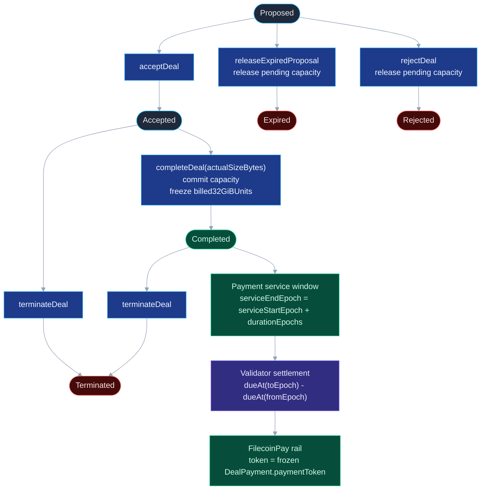

# PoRep Market V2 Diagrams

Status: draft for PR review.

Mermaid is the source of truth here. Export PNGs only when moving the diagrams
to a surface that does not render Mermaid cleanly.

## Offer To Frozen Deal

```mermaid
%%{init: {"theme": "base", "themeVariables": {"background": "#0f172a", "mainBkg": "#1e293b", "primaryColor": "#1e293b", "primaryTextColor": "#e5e7eb", "primaryBorderColor": "#38bdf8", "lineColor": "#94a3b8", "secondaryColor": "#064e3b", "secondaryTextColor": "#d1fae5", "secondaryBorderColor": "#34d399", "tertiaryColor": "#422006", "tertiaryTextColor": "#ffedd5", "tertiaryBorderColor": "#f59e0b", "clusterBkg": "#111827", "clusterBorder": "#475569", "edgeLabelBackground": "#0f172a", "fontFamily": "ui-monospace, SFMono-Regular, Menlo, Monaco, Consolas, monospace"}}}%%
flowchart LR
    sp["SP publishes named offer"]
    terms["Offer terms<br/>size, duration, SLI"]
    tokens["Token payment rows<br/>token + monthly 32GiB price"]
    client["Client picks offer + token<br/>or uses auto-match"]
    freeze{{"Deal snapshot freezes terms"}}
    service["Completion starts service<br/>and FilecoinPay settlement"]

    subgraph registry["SPRegistry: current offer catalog"]
        direction TB
        sp --> terms
        terms --> tokens
    end

    subgraph market["PoRepMarket: frozen agreement"]
        direction TB
        freeze --> service
    end

    tokens --> client --> freeze

    classDef actor fill:#422006,stroke:#f59e0b,color:#ffedd5
    classDef registry fill:#1e293b,stroke:#38bdf8,color:#e5e7eb
    classDef frozen fill:#064e3b,stroke:#34d399,color:#d1fae5
    classDef freeze fill:#78350f,stroke:#f59e0b,color:#ffedd5

    class sp,client actor
    class terms,tokens registry
    class freeze freeze
    class service frozen
```

## Deal Lifecycle And Payment Enforcement

