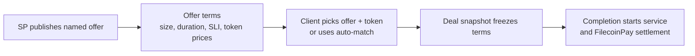

# PoRep Market V2 Overview

Status: draft for review.

V2 changes the deal entry point.

Instead of one provider-wide price, storage providers publish named offers.
Clients pick an offer and payment token, or let auto-match resolve to one. The
deal then freezes the selected terms so later offer edits cannot change the
agreement.



## What Changes For Clients

Clients choose from offers instead of asking the market to interpret one
provider-wide registration.

The deal freezes:

- provider and offer
- payment token and payee
- monthly price
- requested size
- paid duration
- SLI terms

Auto-match can still exist, but it should resolve to the same offer-based deal
shape as direct offer selection.

## What Changes For Storage Providers

Providers move from one registration price to one or more offers.

Offer names let the SP name the service/offer clients see in UI. They are
labels, not descriptions.

Capacity stays provider-level in the starting scope. It is not split per offer
or per token.

Changing an offer changes the current market. It does not rewrite existing
deals.

## Deal Flow

1. Provider publishes an offer
2. Client proposes a deal against an offer/token
3. Market freezes the deal snapshot
4. Provider accepts
5. Completion starts service and payment
6. Validator settles FilecoinPay from frozen deal terms

## Payment And Duration

Price stays monthly per 32GiB. FilecoinPay receives a ceiling per-epoch rail
rate, while settlement uses exact cumulative math from the frozen monthly price.
This keeps the rail safe without turning integer truncation into underpayment.

Clients request duration in days. The market stores the paid service duration in
epochs and derives the service end from completion:

```text
serviceEndEpoch = serviceStartEpoch + durationEpochs
```

`termMax` remains Filecoin claimability slack. It is not extra paid service.

## Pilot Scope

This pass is about token-bound offers and frozen deal terms.

It does not cover native FIL, token fallback, cross-token price comparison,
offer-level capacity, token-specific payees, collateral, or generic constraints.

Strict SLI checking, slashing, and payment penalties are deferred from the first
pilot deals.

## Technical Spec

- [`porep-v2.md`](./porep-v2.md) - starting contract shape
- [`porep-v2-propositions.md`](./porep-v2-propositions.md) - reviewable propositions and remaining questions
- [`porep-v2-spregistry-storage.sol`](./porep-v2-spregistry-storage.sol) - living provider/offer state
- [`porep-v2-market-storage.sol`](./porep-v2-market-storage.sol) - frozen deal state
- [`porep-v2-validator-storage.sol`](./porep-v2-validator-storage.sol) - rail identity and settlement guard state
- [`porep-v2-architecture-diagrams.md`](./porep-v2-architecture-diagrams.md) - offer freeze and lifecycle/payment diagrams
